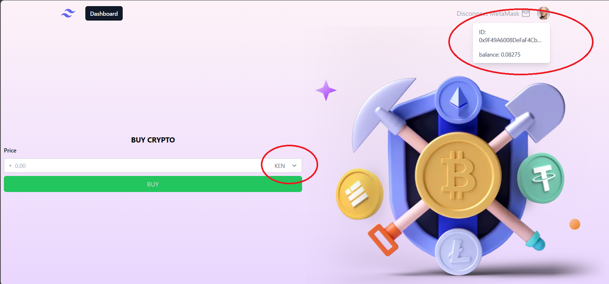

# WEB 3 การซื้อ COIN TOKEN

แพลตฟอร์มการซื้อขายคริปโต มีทั้งหมด 2 เหรียญ KENJA และ KEMI

## รายละเอียด

หัวข้อโปรเจค
แพลตฟอร์มการซื้อขายคริปโต

รายละเอียด
นี้คือแอปพลิเคชัน React สำหรับแพลตฟอร์มการซื้อขายคริปโตที่อนุญาตให้ผู้ใช้เชื่อมต่อกระเป๋า MetaMask ของพวกเขา เช็ครายละเอียดบัญชีและซื้อโทเค็นคริปโต

## การติดตั้ง
1. repository
``` bash
git clone https://github.com/sekkarin/web3-react.git
```
2. ติดตั้ง dependencies
``` bash
npm install
```
3. รันแอปพลิเคชัน
``` bash
npm run dev 
```
## การใช้งาน
1. เชื่อมต่อ MetaMask:
    *   คลิกที่ปุ่ม "Connect MetaMask".
    *   MetaMask จะแจ้งผู้ใช้เชื่อมต่อกับแอปพลิเคชัน.
2. ซื้อคริปโต:

    *   ป้อนจำนวนที่ต้องการในช่องป้อนที่เรียกว่า "Price."
    *   เลือกโทเค็นคริปโตที่ต้องการจากเมนูดรอปดาวน์.
    *   คลิกที่ปุ่ม "BUY."
    *   หากธุรกรรมเป็นที่สำเร็จ, จะแสดงรหัสธุรกรรม และผู้ใช้สามารถคลิกเพื่อดูรายละเอียดใน Etherscan.
3. ตัดการเชื่อมต่อ MetaMask:
    *   คลิกที่ปุ่ม "Disconnect MetaMask."
## คุณสมบัติ
* การผนวก MetaMask:
    * ผู้ใช้สามารถเชื่อมต่อกระเป๋า MetaMask กับแอปพลิเคชันได้
    * แอปพลิเคชันรองรับกระบวนการเปิดใช้งาน MetaMask
* ข้อมูลบัญชี:
    * แสดง ID บัญชี MetaMask ของผู้ใช้
    * แสดงยอดคงเหลือโทเค็นของผู้ใช้
* การซื้อคริปโต:
    * ผู้ใช้สามารถป้อนจำนวนคริปโตที่ต้องการซื้อ
    * ผู้ใช้สามารถเลือกโทเค็นคริปโตที่ต้องการจากเมนูดรอปดาวน์
    * แสดงรหัสธุรกรรมหลังจากการซื้อเสร็จสมบูรณ์
* การออกแบบที่ Responsive:
    * ออกแบบแอปพลิเคชันเพื่อให้เข้ากับหน้าจอขนาดต่าง ๆ
## Dependencies
* @web3-react/core: ไลบรารีสำหรับการจัดการการเชื่อมต่อ web3
* @web3-react/metamask: ตัวเชื่อมต่อ MetaMask สำหรับ web3
* ethers: ไลบรารี JavaScript สำหรับ Ethereum สำหรับการติดต่อกับสมาร์ทคอนแทรค
* @ethersproject/units: ฟังก์ชันช่วยสำหรับการแปลงหน่วย Ethereum
* @headlessui/react: คอมโพเนนต์ UI ที่สามารถเข้าถึงได้สำหรับ React
* @heroicons/react: ชุดไอคอน SVG ฟรีที่ได้รับอนุญาต MIT สำหรับการพัฒนา UI

## ภาพรวมของเว็บไซต์
* หน้าแรก

* เชื่อมต่อกระเป๋า MetaMask

* ดูลายละเอียด ผู้ใช้งาน และ แสดงยอดคงเหลือโทเค็นของผู้ใช้

* การซื้อ Token

* แสดง hash และ สามารถคลิกเพื่อดูรายละเอียดใน Etherscan


* เช็ค tokens


